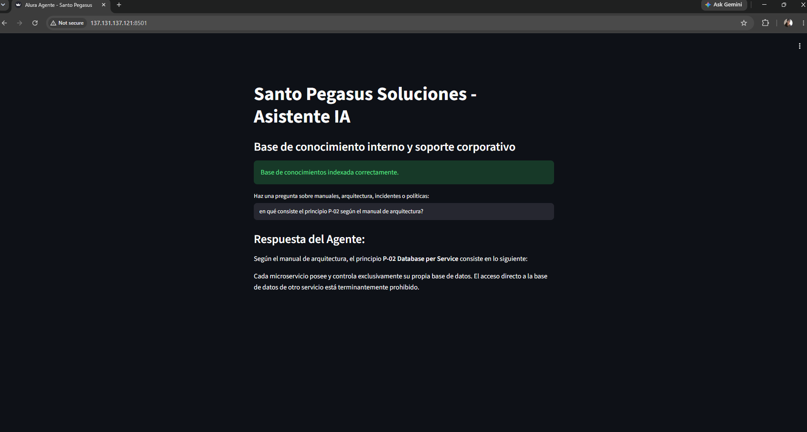
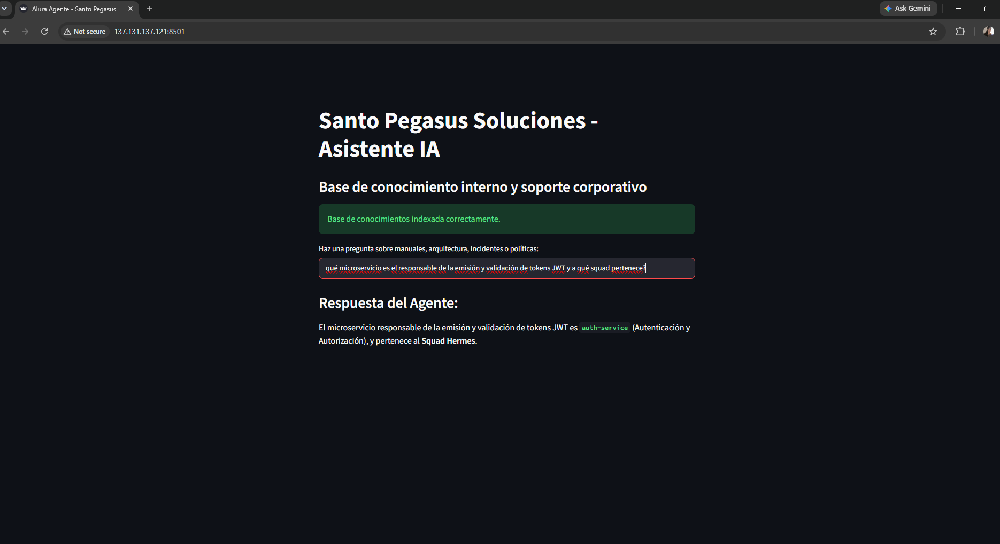
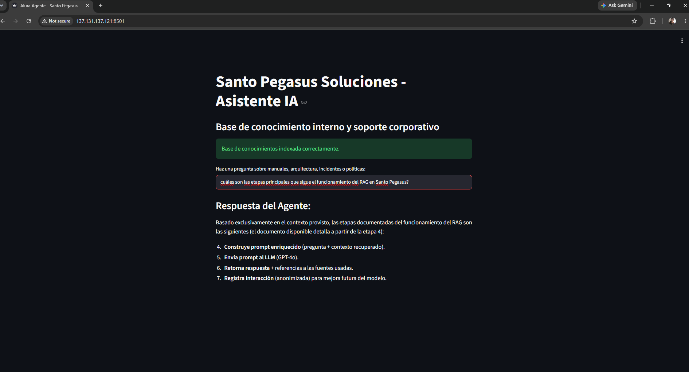
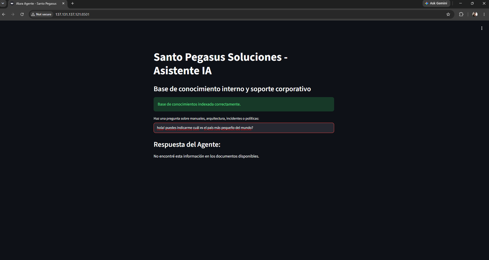

# Alura Agente - Santo Pegasus Soluciones

**Desarrollado por:** Nathaly Prieto

Este proyecto es la entrega final del **Challenge Alura Agente** para la formación ONE AI FOR TECH. Consiste en un asistente de Inteligencia Artificial desarrollado para interactuar con la base de conocimiento interno (manuales, arquitectura e incidentes) de la empresa Santo Pegasus Soluciones.

## Descripción General

El objetivo de este proyecto es resolver la pérdida de tiempo en la búsqueda de información interna. El agente permite a los colaboradores realizar preguntas en lenguaje natural y obtener respuestas precisas, extraídas exclusivamente de los documentos oficiales de la empresa, evitando alucinaciones mediante un prompt de sistema estricto.

## Arquitectura de la Solución

El sistema implementa **RAG (Retrieval-Augmented Generation)** orquestado con **LangChain** y potenciado por la **API de Google Gemini**. El flujo completo es:

1. **Extracción y Carga:** Se utiliza `PyPDFLoader` (LangChain) para leer el documento de arquitectura de microservicios.
2. **Chunking:** El texto se divide en fragmentos de 1200 caracteres con un solapamiento de 150 usando `RecursiveCharacterTextSplitter`.
3. **Indexación Vectorial:** Se generan embeddings con **Gemini** (`gemini-embedding-001`) y se almacenan en **ChromaDB**.
4. **Recuperación (Retrieval):** LangChain recupera los 4 fragmentos (K=4) más relevantes semánticamente según la consulta del usuario.
5. **Generación:** **Gemini** (`gemini-3.5-flash`) recibe el contexto recuperado mediante una cadena RAG de LangChain Classic y formula la respuesta final, respetando la regla de no inventar información.

## Tecnologías Utilizadas

* **Lenguaje:** Python 3
* **Framework Web:** Streamlit
* **Orquestación IA:** LangChain / LangChain Classic
* **Modelos IA:** Google Gemini API (`gemini-embedding-001` para embeddings y `gemini-3.5-flash` para generación)
* **Base de Datos Vectorial:** ChromaDB
* **Despliegue Cloud:** Oracle Cloud Infrastructure (OCI Compute)

## Instrucciones de Ejecución (Local)

1. Clona este repositorio.
2. Crea un entorno virtual e instala las dependencias:

   ```bash
   python -m venv venv
   source venv/bin/activate   # En Windows: venv\Scripts\activate
   pip install -r requirements.txt
   ```

3. Coloca el PDF de Santo Pegasus en la raíz del proyecto: `Arquitectura de Microservicios y Mapa de Dominios — Santo Pegasus Soluciones.pdf`
4. Configura tu variable de entorno con tu API Key de Gemini:

   ```bash
   export GOOGLE_API_KEY="tu_clave_aqui"
   ```

5. Ejecuta la aplicación:

   ```bash
   streamlit run app.py
   ```

6. Abre el navegador en `http://localhost:8501` y realiza una pregunta sobre el documento indexado.

## Despliegue en OCI

La aplicación está desplegada en una instancia de **OCI Compute** (Ubuntu) y es accesible públicamente en:

**[http://137.131.137.121:8501](http://137.131.137.121:8501)**

Para levantar la aplicación en el servidor:

```bash
streamlit run app.py --server.port 8501 --server.address 0.0.0.0
```

Recuerda configurar las reglas de **Security List / Network Security Group** para permitir tráfico entrante en el puerto 8501.

## Ejemplos de Prueba

Las siguientes consultas fueron ejecutadas contra el agente en producción (OCI) para validar recuperación, precisión técnica y control de alucinaciones:

| # | Pregunta | Respuesta esperada / obtenida |
|---|----------|-------------------------------|
| 1 | ¿En qué consiste el principio P-02 según el manual de arquitectura? | El principio **P-02 Database per Service**: cada microservicio posee y controla exclusivamente su propia base de datos; el acceso directo a la BD de otro servicio está prohibido. |
| 2 | ¿Qué microservicio es el responsable de la emisión y validación de tokens JWT y a qué squad pertenece? | **auth-service** (Autenticación y Autorización), perteneciente al **Squad Hermes**. |
| 3 | ¿Cuáles son las etapas principales que sigue el funcionamiento del RAG en Santo Pegasus? | Recuperación de contexto, construcción del prompt enriquecido, envío al LLM, retorno de respuesta con referencias y registro de interacción. |
| 4 | ¿Cuál es el país más pequeño del mundo? | *No encontré esta información en los documentos disponibles.* (fallback ante preguntas fuera del contexto corporativo) |

## Evidencias del Despliegue en OCI

**1. Prueba de arquitectura (Principio P-02):**



**2. Prueba técnica (Auth Service / JWT):**



**3. Prueba de flujo RAG (Etapas del pipeline):**



**4. Control de alucinaciones (Fallback):**


